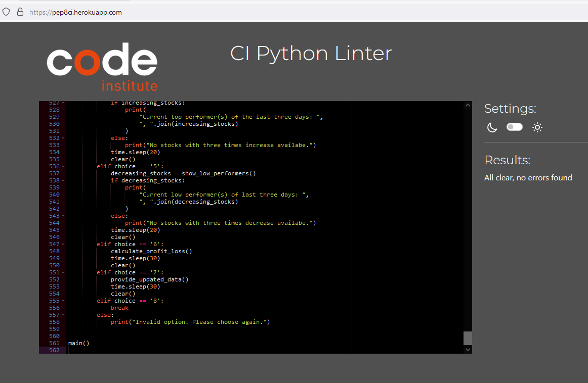
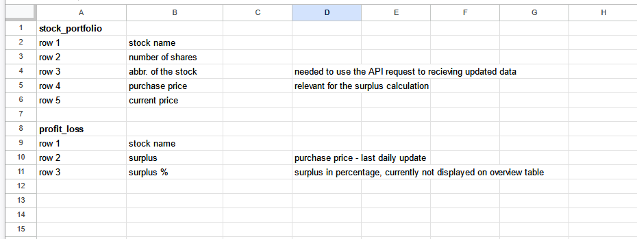

# Stock analyst

Welcome to my third project, 'stock analyst'. It is a script that supports people in analyzing their stock portfolio by using a Google Spreadsheet to store stock information and an additional API to receive updated stock information. The focus is on the terminal screen. Since there are currently just basic checks implemented, this is a portfolio manager tool for leisure brokers. However, by adding more functions based on the input data, the tool can be used for more extensive analyses of the stock information.

The project provides an overview table for the user to see their portfolio - stock names and further details such as the number of shares, stock prices, and profit/loss.
The overview is displayed at the beginning together with all options such as 'add stock', 'delete stock', 'adjust number of shares', ... (see image).
Once an option is chosen, the display still appears together with further input requests for the user.

## Remarks for handeling the program
Since not all automations are set, the Google worksheets have to be updated manually every day. That means each day the current price has to be added to the column by using option 7. The Alpha Vantage API is limited to 25 requests. That means after a few requests the limit is reached. The Google API is limited by 350 requests per minute.

Since the automatic update of the sheet stock_daily_update is not finalized, the surplus remains 0 as long as the values are added manually in the sheet itself. The sheet is shared, the access code is provided in the detail section of the project submission form. 

The stock prices is not updated automatically in the sheet. This would cause additional requests. Therefore, the user needs daily access to the Google sheet so that he can manually add the current prices column by column every day which is provided in the tool.

Since both APIs from Google and Alphaventage (free software) are limited the validation column_check() is deactivated. The error handling for API Alphaventage is in place, the error handling for Google API is not working accurate - a describtion is mentioned in the section 'BUGs (not fixed)'.

## Features

### Feature overview:

| Feature | Description  | images |
| ------------- |------------- | ------------- |
|show portfolio | The feature displays the current status of the portfolio in a table: stock names and number of shares by using a assci feature. ||
|add stock |The feature adds the new stock name to the sheet and adds the number of shares ||
|delete stock |The feature identifies the relevant stock and deletes it, deletes number of shares and deletes ||
|adjust number of shares |The feature enables the user to adjust the number of shares of existing stocks ||
|show top performers | The feature analyzes the last three available data points and identifies stocks with rising values ||
|show low performers | The feature analyzes the last three available data points and identifies stocks with decreasing values||
|calculate profit loss | The feature calculates profit loss by substract the first stock values from the last one in a each column. ||
|check columns | The feature validates the google spreadsheets with regards to the length of rows. In case all rows have the equal lenght it is partly ensured that there haven't been a mistake in the last update. However, it does not check each single column if the format type is wrong or if a single cell has been deleted.  ||
|clear function| The feature clears the terminal to provide a better user experience ||
|find stock symbol | The feature provides a list of stock symbols which has to be selected form the user. This symbol is relevant to creat the correct API request url for further functions.||
|provide updated data | The feature helps to update the current price. It provides the price together with the symbol. It can be copy paste to the google spreadsheet.||

Here the main function in more detail:

#### check columns
The function validates whether all tables have the same number of columns. If not, a note is provided so that the user can check the worksheets. Due to API request limitations, the function is currently deactivated.

#### show portfolio
Displays the table of stocks. The information is pulled from various Google Sheets: SHEET.worksheet('stock_portfolio'), SHEET.worksheet('stock_daily_update'), and profit_loss_sheet = SHEET.worksheet('profit_loss'). The relevant rows are retrieved, and then the individual values of each cell are extracted using a loop with an index.

PrettyTable is used to generate the table layout, which is incorporated within the loop function. Additionally, the time of table generation is displayed below the table.

The price values depend on the API connection. If the worksheets are updated, the current price is shown. Otherwise, the data reflects the latest update.

#### add stock
When a new stock is entered, a new column is added to the right of the existing table. It is crucial that the new stock name and its parameters are added to all three Google Sheets to ensure the functionality of the other functions: SHEET.worksheet('stock_portfolio'), SHEET.worksheet('stock_daily_update'), and profit_loss_sheet = SHEET.worksheet('profit_loss'). A check function is implemented at the beginning. A while-True loop, if-else, and try-except functions are used as well.

#### delete stock
This function searches for the user input and deletes the stock from all three Google Sheets: SHEET.worksheet('stock_portfolio'), SHEET.worksheet('stock_daily_update'), and SHEET.worksheet('profit_loss'). An if-else function is used.

#### adjust adjust multiplicator (number of shares)
Once the option is selected, an input is requested from the user. After entering the new number of shares, it will be updated in the relevant Google Sheet SHEET.worksheet('stock_portfolio'). An if-else and a try-except function are used.

#### show top performers
Using a for loop and if-else functions, the values of the last three entries in SHEET.worksheet('stock_daily_update') for each relevant column are pulled and analyzed. When all three entries show an increasing trend over time, the stock is identified as a current top performer. All top performers are displayed in the terminal.

#### show low performers
Using a for loop and if-else functions, the values of the last three entries in SHEET.worksheet('stock_daily_update') for each relevant column are pulled and analyzed. When all three entries show a decreasing trend over time, the stock is identified as a current low performer. All low performers are displayed in the terminal.

#### calculate profit loss
The profit and loss function calculates the surplus by comparing the purchase price (row 2, SHEET.worksheet('stock_daily_update')) and the latest price value (row 5, SHEET.worksheet('stock_daily_update')). The result is saved in SHEET.worksheet('profit_loss') and displayed in the overview table.

## UX Design
Since the program is accessible via a terminal, the design is limited. However, user experience remains important. Therefore, some adjustments have been made.

The tool helps the user manage their stock portfolio.

The size of the terminal is increased to 50 rows (in index.html and default.js). To avoid information overload and make the tool more convenient for users unfamiliar with a terminal, the terminal is cleared each time a new function is used, and the overview is updated with the new input.

The portfolio should be displayed as often as possible, nefore and afte reach function at the top. However, due to API limitation the portfolio is shown, but not updated as much as it would be ideally for the user.

## User Stories

### New Site Users

- As a new user, I would like to have to know what the tool is about
- As a new user, I would like to have a good overview about the functionalities of the tool
- As a new user, I would like to have a good overview in the terminal. It should be not overwhelmed with information
- As a new user, I would like to have a tool that helps me managing my stock portfolio adding, removing and adjusting the portfolio
- As a new suer, I would like to get informed by the tool if an error occures and what I have to do to continue

### Returning Site Users

- As a returning user, I would like to have a tool that helps me managing my stock portfolio
- As a returning user, I would like to have a tool that provides me current stock prices
- As a returning user, I would like to have a tool that shows me good and bad performing stocks form my portfolio

## Testing
    
    - Testing was conducted regularly in small intervals throughout the development process as well as at the end of the project to ensure functionality and identify any potential issues early on.
    - Bugs that were encountered during testing have been thoroughly documented in the Bug section, detailing the nature of the issue and the steps taken to resolve it.
    - Validators were used to ensure that the code meets all necessary standards and specifications. More details can be found in the Validators chapter.
    - Logic checks were performed to verify that the program's operations and algorithms were working as intended. This included testing different scenarios and edge cases to ensure robustness.
    - Manual input tests were carried out to simulate real-world usage of the application. This involved entering data manually into the system to ensure that all inputs were handled correctly and that the user interface responded appropriately.

### Bugs (not fixed)

| Bug | Description  | images (optional) | Correction | 
| --- |------------- | ----------------- | -----------|
| Google API Error | The limit for Google Spreadsheet usage has been reached, making further requests impossible. This appears to be the explanation for the issue. The number of API requests can be quite high due to the code interacting with multiple worksheets, update functions, and validation processes.  |  | To maintain system functionality and improve user experience, a solution was implemented. However, it has not been successful; Google seems to ignore the error handling (See screenshot of code). As a result, the code has been adjusted to minimize unnecessary requests. The validation function check_column has been deactivated, and users need to be more cautious when managing the sheets. | 

### Bugs (fixed)

| Bug | Description  | images (optional) | Correction | 
| --- |------------- | ----------------- | -----------|
| Error_list_index_out_of_range | The worksheet does not contain a reference. A new stock was added, but a value is missing in the column. |  | Adding a validation when a new stock name is added to stock_portfolio sheet. |
| TypeError_unsupported_operand_type_for_str | Using string values for calculations results in an error. |  | adding float() to the variabels: rounded_profit_loss_value_percentage = ((float(first_column_value) - float(last_column_value)) / float(first_column_value))* 100 |
| IndexError_list_index_out_of_range | This IndexError indicates a mismatch in the lengths of the header and shares_row lists. This mismatch can occur if there are fewer elements in shares_row than in header, or vice versa. || Consequently, it is necessary to make sure that there is no mismatch by adding or deleting a stock| 
| DeprecationWarning | DeprecationWarning: The order of arguments in worksheet.update()` has changed. |  | code snipped was not valid anymore. variable was deleted |

### Validator Testing
Validator testing has been done on:

#### [CI Python validator](https://pep8ci.herokuapp.com/)

No errors were returned for run.py

IMAGE UPDATE NEEDED!

    
further results of HTML, CSS Validator

#### [HTML validator](https://validator.w3.org/)

No errors were returned

#### [CSS validator](https://jigsaw.w3.org/css-validator/)

No errors were returned

#### [JS Validator] (https://jshint.com/)

Errors occured. However, since I reused the suggested template from Code Institute and I haven't made any adjustments I keep the current status.

Code from index.js and defaul.js checked. 

Here an example of index.js

#### Accessability (delete)
I confirm that the selected colors and fonts are easy to read and accessible by using Lighthouse in devtools (Chrome).

 

## Deployment
The site was deployed to a Heroku page using a GitHub repository for data storage.

Heroku page: https://stock-analyst-390ed9b08457.herokuapp.com/
GitHub repository: https://github.com/Fl0W97/ci-p3-stock-analyst

### Configure Heroku 
The steps to configure Heroku are as follows:

Log in to your account, or set up a new one
Create a new app on Heroku
 

#### Connect to GitHub
Next, you can configure deploys with Github. If you prefer to deploy without using Github, you can read Heroku's deployment documentation. https://devcenter.heroku.com/categories/deployment

In the Deploy tab, select the option to Connect this app to GitHub

Select the branch you want to deploy your app from

#### Add Discord credentials
Before your app can go online, you'll have to configure your Heroku environment with your Discord bot's credentials:
Add your bot’s TOKEN, GUILD_ID, CLIENT_ID, and any other credentials your bot might need. More details on credentials for Baker bot can be found in the tutorial.

#### Add a buildpack
Next, add a Heroku buildpack to your app. Click add a buildpack to your app and configure it for NodeJS.

### GitHub

The steps to set up your repository in GitHub are as follows:

- In the GitHub repository, navigate to the Settings tab
- From the source section drop-down menu, select the Main Branch, then click "Save"
- The page will be automatically refreshed with a detailed ribbon display to indicate the successful deployment.

    
Cloning repository

1. Visit the GitHub repository.
2. Find the Code button situated above the file list and give it a click.
3. Choose your preferred cloning method — whether it's HTTPS, SSH, or GitHub and hit the copy button to copy the URL to your clipboard.
4. Launch Git Bash or Terminal.
5. Navigate to the directory where you want the cloned directory to reside.
6. In your IDE Terminal, input the following command to clone the repository:
 git clone https://github.com/Fl0W97/ci_p3_stock-analyst.git
7. Press Enter to create your local clone.

## Tools & Technologies used

The main functions are generated with Python. However, to set up the whole project a standard template consits of files of json, js, txt, html and css.

- node.js
- phython (import prettyTable, os, gspread, datetime, requests, json)
- Git used for version control (git status, git add, git commit)
- GitHub used for secure online code storage
- GitHub Pages used for hosting the deployed front-end site
- GitHub- template reused from love sandwiches
- Gitpod used for local IDE for development
- Heroku
- JavaScript
- Html
- CSS

## Set up (API) Google spreadsheet, add-on Alphavantage 

### Step 1: Create a Google Spreadsheet

details

First create a google account https://myaccount.google.com/

    Sign in to Google Account:
        Go to Google Sheets and sign in with your Google account.

    Create a New Spreadsheet:
        On the Google Sheets homepage, click the + button labeled "Blank" to create a new spreadsheet.

    Name Your Spreadsheet:
        Click on "Untitled Spreadsheet" at the top left corner and enter a name for your spreadsheet.

### Step 2: Set Up Your Spreadsheet

details

    Enter Data:
        Enter your data in the cells of the spreadsheet. You can start with simple data entries, such as column headers and rows of data.

    Format Cells (Optional):
        You can format the cells by selecting them and using the toolbar options (e.g., bold, italic, text color, cell background color, etc.).

    Save Your Work:
        Google Sheets automatically saves your work as you go. However, it’s good practice to ensure your data is saved by checking the "Saved to Drive" message at the top.

### Step 3: Add Alphavantage Google Add-on

details

    Open Add-ons Menu:
        In your Google Spreadsheet, go to the top menu and click on Extensions, then select Add-ons.

    Get Add-ons:
        Click on Get add-ons from the drop-down menu. This will open the Google Workspace Marketplace.

    Search for an Add-on:
        In the Google Workspace Marketplace, use the search bar to find the add-on 'Alphavantage Market Data'

    Install the Add-on:
        Once you find the desired add-on, click on it to open its details page.
        Click on the Install button. A pop-up window will appear asking for permissions.
        Review the permissions and click Allow to proceed with the installation.

</

### Step 4: Use the Add-on

details

    Activate add-on Alphavantage with API-KEy

        Get Alphavantage API Key:
        Go on https://www.alphavantage.co/support/#api-key and request an API Key.
        Go back in the Google spreadsheet to Extensions in the menu, go an Alphavantage and enter the API Key.
        Now you can start using formulars of Alphavantage to enter those in the spreadsheet.

Find more details on https://documentation.alphavantage.co/GoogleSheetsMarketDataAddon/V_1/index.html

        
        Find here an overview of possible add-on formulas and how they will be added.
        https://documentation.alphavantage.co/GoogleSheetsMarketDataAddon/V_1/example_screens.html
        https://documentation.alphavantage.co/GoogleSheetsMarketDataAddon/V_1/function_reference/index.html

### Description Google API Set up

Steps to get your credentials file for users with the "new" form UI:

    1. From the "Which API are you using?" dropdown menu, choose Google Drive API
    2. For the "What data will you be accessing?" question, select Application Data
    3. For the "Are you planning to use this API with Compute Engine, Kubernetes Engine, App Engine, or Cloud Functions?" question, select No, I'm not using them
    4. Click Next
    5. Enter a Service Account name, you can call it anything you like - I will call mine "LoveSandwiches" - then click Create
    6. In the Role Dropdown box choose Basic > Editor then press Continue
    7. These options can be left blank, click Done
    8. On the next page, click on the Service Account that has been created
    9. On the next page, click on the Keys tab
    10. Click on the Add Key dropdown and select Create New Key
    11. Select JSON and then click Create. This will trigger the json file with your API credentials in it to download to your machine. 
    12. You can now return to the video at timestamp 3:57 (transcript point "into our computer files. For most computers, this will automatically go in your downloads folder,")

Connecting Google worksheet with Python via API

### Description Google sheets 

The structure of the google worksheet is displayed in the image above. There are four sheets: "description", "stock_portfolio", "Stock_daily_update" and "profit_loss". The three last sheets have the same headers and different values such as number of shares, purchase price and daily prices.

Shows sheet_stock_portfolio

Shows sheet stock_daily_update

Shows sheet profit_loss

### Description Alpha Vantage API
Alpha vantage is a free proivder of stock information. 25 requests per day are included in the free version. you can find here an extensive API documentation: https://www.alphavantage.co/documentation/

details

The documentation shows a standard API documentation including request urls, parameter definition.

The API function TIME_SERIES_DAILY is used in this project.

It shows the stock price of one single stock of the last 100 days. This colums contain the parameters timestamp, open, high, low, close and volume

https://www.alphavantage.co/documentation/#time-series-data

THe API function SYMBOL_SEARCH is used in this project.

It enables the user to find the exact stock symbol as reference to get the correct stock price values. As search input usually the company name can be used. It provides a list of symbol codes which are used for the time_series_day function. This colums contain the parameters symbol, name, type, region, marketOpen, marketClose, timezone, currency, matchScore.

https://www.alphavantage.co/documentation/#symbolsearch

The google add-on has been tested successfully. It can be easily integrated into a google spreadsheet.
However, due to better and more flexible handling of the data no add-on function is used. 

Links for googlesheet add-on integration:
https://documentation.alphavantage.co/GoogleSheetsMarketDataAddon/V_1/example_screens.html#avsearchequitysymbol

## Improvements and ideas for subsequent projects

- **Purchase Premium API Version**: Buy the premium version of the Alpha Vantage API to remove the limitation of 25 requests per day.
- **Reactivate and Enhance Validations**: Reactivate the `check_column` function and add additional validations to ensure data integrity.
- **Update Table Overview**: Include the profit and loss percentage in the table overview for better financial insights.
- **Automate Google Spreadsheet Updates**: Implement automatic updates for the `stock_daily_update` Google Spreadsheet. Use the 'Time Series' data from Alpha Vantage ([documentation](https://www.alphavantage.co/documentation/#time-series-data)). Each day, add a new value for each existing stock to the last column. Display the surplus after two days and analyze stock performance as a low or top performer after three days. Additional rules and chart techniques can be incorporated for more comprehensive analysis.
- **Improve HTML and JavaScript Design**: Enhance the HTML and JavaScript files to improve design aesthetics. Center the terminal, add attractive images with links to financial resources, and implement news snippets or links related to stocks.
- **Secure API Key**: Due to security concerns, avoid exposing the API key in the code. Instead, hide it and configure it as a parameter in `creds.json`.
- **Add Failure Handling for Google API**: Implement failure handling for Google API usage, as it is subject to its own set of limitations.

## Credits

### Content
By going through the API documentation and further examples of Alpha Vantage I decided which options will be added. Series update and smybol search seems a good start for providing stock information.

https://www.alphavantage.co/documentation/#symbolsearch
https://documentation.alphavantage.co/GoogleSheetsMarketDataAddon/V_1/function_reference/index.html

Description of Heroku deployment is resused from github project
https://github.com/discord/heroku-sample-app/blob/main/README.md

Ideas and the API documentation of The walkthrough Project Love Sandwiches was reused and adjusted.

### Code

| No | Description  | Source | URL |
| -- | ------------ | ------ | --- |
| 1 | Python Specific core concepts | Code institute | i.e. https://learn.codeinstitute.net/courses/course-v1:CodeInstitute+CPP_06_20+3/courseware/f780287e5c3f4e939cd0adb8de45c12a/8d9c1efb1864472bb682a0c233898a17/ |
| 2 | clear terminal | portal stackoverflow.com | https://stackoverflow.com/questions/517970/how-can-i-clear-the-interpreter-console |
| 3 | datetime | Code Institute | https://learn.codeinstitute.net/courses/course-v1:CodeInstitute+CPP_06_20+3/courseware/272f493b4d57445fbd634e7ceca3a98c/4ab3e01af44f4bf2828739c1d0591a45/|
| 4 | restrict float value | Stackoverflow.com | https://stackoverflow.com/questions/75459360/how-to-fix-the-typeerror-can-only-concatenate-str-not-float-to-str, https://pythonhow.com/how/limit-floats-to-two-decimal-points/ |
| 5 | converting a listint | Stackoverflow.com | https://stackoverflow.com/questions/1528724/converting-a-listint-to-a-comma-separated-string|
| 6 | use request libary for API set up | Stackoverflow.com | https://realpython.com/python-requests/ |
| 7 | working with spreadsheets via API | Code institute, Stackoverflow | https://learn.codeinstitute.net/courses/course-v1:CodeInstitute+LS101+1/courseware/293ee9d8ff3542d3b877137ed81b9a5b/071036790a5642f9a6f004f9888b6a45/, https://stackoverflow.com/questions/59272851/python-gspread-changing-contents-of-a-cell-based-on-contents-of-another-cell, https://www.sitepoint.com/using-python-parse-spreadsheet-data/ |
| 8 | using ascci tables to improve visualization of stock overview | Forum geeksforgeeks.org | https://www.geeksforgeeks.org/generate-simple-ascii-tables-using-prettytable-in-python/ |
| 9 | f" print variable | Stackoverflow.com | https://stackoverflow.com/questions/17153779/how-can-i-print-variable-and-string-on-same-line-in-python
| 10 | API request check, example | https://stackoverflow.com/questions/54087303/python-requests-how-to-check-for-200-ok
| 11 | Get the last non-empty cell in a column | Reddit.com, Hackernoon.com | https://www.reddit.com/r/googlesheets/comments/z1itez/get_the_last_nonempty_cell_in_a_column/?rdt=38792, https://hackernoon.com/how-to-find-the-last-non-empty-row-in-a-column-with-google-apps-script-accurately |
| 12 | Set up Google API for spreadsheets | Code Institute, Love Sandwiches Walkthrough Project Getting Set Up Connecting to our API with Python | https://learn.codeinstitute.net/courses/course-v1:CodeInstitute+LS101+1/courseware/293ee9d8ff3542d3b877137ed81b9a5b/071036790a5642f9a6f004f9888b6a45/